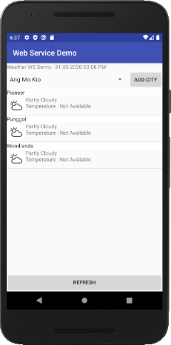
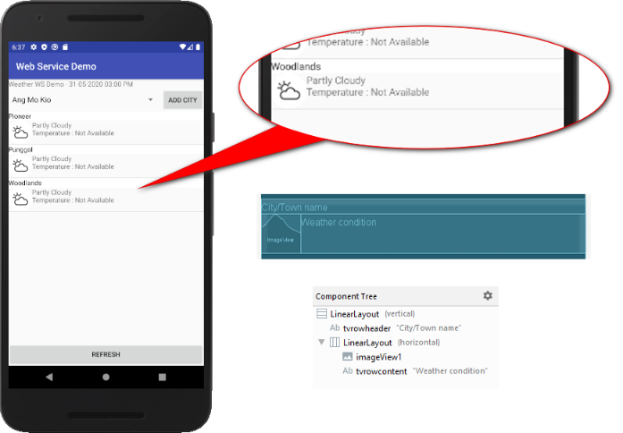
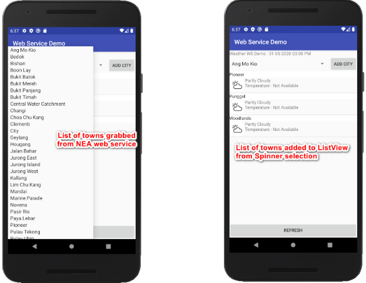
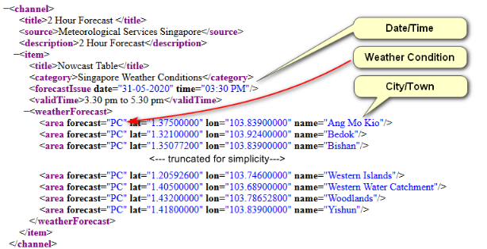

# WeatherWSDemo
Demonstration on usage of web services for Java Android Development 

This is how the Android App looks like upon launch. 



## Design

Java data class used:


UI Design:



## Application logic




## Source of data:

http://api.nea.gov.sg/api/WebAPI/?dataset=2hr_nowcast&keyref=781CF461BB6606AD4852D40C8C54E93C9193030D51B73AFB



Basic code to retrieve XML data from a web service:

```
String StringUrl = "http://api.nea.gov.sg/api/WebAPI/?dataset=2hr_nowcast&keyref=781CF461BB6606AD4852D40C8C54E93C9193030D51B73AFB";
url=new URL(StringUrl);

HttpURLConnection httpConnection = (HttpURLConnection) url.openConnection();
InputStream in = httpConnection.getInputStream();

DocumentBuilderFactory dbf = DocumentBuilderFactory.newInstance();
DocumentBuilder db=dbf.newDocumentBuilder();

Document dom=db.parse(in);
Element docEle=dom.getDocumentElement();
```

Java code to extract a specific node based on a Tag.
There is only an instance of "forecastIssue", this the hard code of item(0).

```
//Forecase date/time
Element forecastDate = (Element) docEle.getElementsByTagName("forecastIssue").item(0);
date = forecastDate.getAttribute("date") + " " + forecastDate.getAttribute("time") ;
```

Java code to extract a list of nodes based on a Tag

```
//Getting weather forecast based on towns/cities
NodeList nl=docEle.getElementsByTagName("area");
if (nl != null && nl.getLength() > 0) {
	for (int i = 0; i < nl.getLength(); i++){
		Element eleItem = (Element) nl.item(i);

		String city = eleItem.getAttribute("name");
		String condition = eleItem.getAttribute("forecast");
    	String img = "https://www.nea.gov.sg/assets/images/icons/weather-bg/" + condition + ".PNG";
	
		al.add(new Weather(city, condition, img));
	}
}
```


## Additional Library 

3rd party plug-in used to dynamically load remote remote image file into ImageView

Piccaso - https://square.github.io/picasso/
